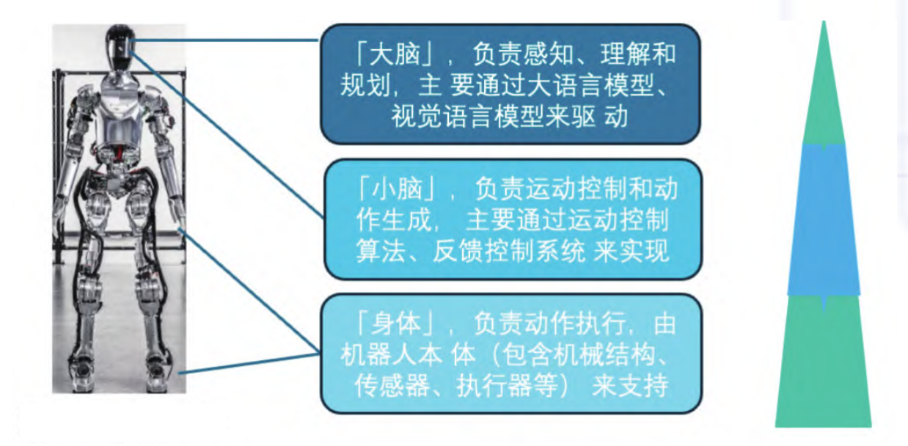
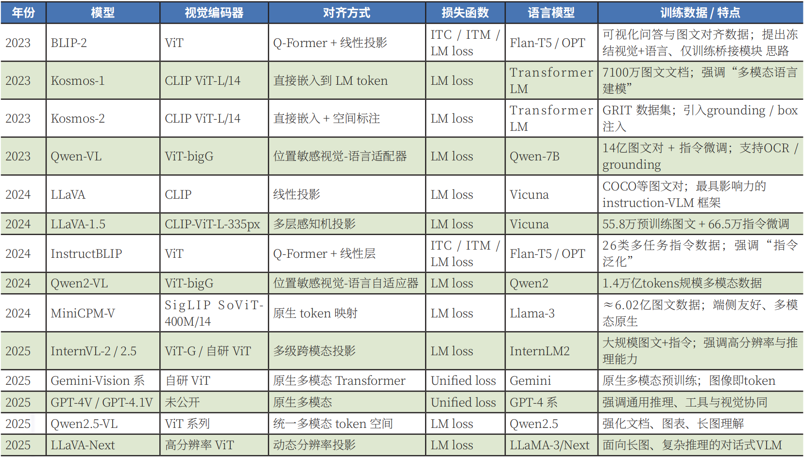

# 论文导读：基于多模态大模型的具身智能体研究进展与展望

## 1. 论文概览

- **论文标题**：基于多模态大模型的具身智能体研究进展与展望
- **作者**：清华大学和北京面壁智能科技有限责任公司联培博士后工作站 曹群、北京面壁智能科技有限责任公司 郭昕哲、雷升涛
- **发表年份**：2026
- **主要贡献**：系统梳理了具身智能体的研究现状，重点解构了任务规划与动作控制的协同机制，评估了现有研究在应对复杂环境时的局限性，为未来的具身智能系统开发提供战略性的前瞻分析。

## 2. 核心方法

### 2.1 多模态大模型的崛起
- 视觉-语言对齐技术在具身智能体的多模态构建中扮演至关重要的角色
- 技术演进始于ViT对视觉特征提取方式的革新，将离散图像块映射至低维流形空间
- 2023年的BLIP-2将视觉信息嵌入到冻结的LLM语境中，实现了"轻量化、高保真"的特征提取
- 近两年研究范式发生显著迁移：2024年聚焦于"感知的深度"，2025年开启了"具身行动"元年

### 2.2 从视觉语言模型到具身大模型
- 具身智能体的核心在于构建一个能够统合环境感知、指令解析及自我状态评估的智能中枢
- 具身智能体可分为不同类别：机器人（如固定基座机械臂、四足机器人、人形机器人等）、自动驾驶系统、虚拟智能体等
- 具身智能体中"大脑"与"小脑"的协同配合：
  - "大脑"负责感知、理解和决策，是系统的核心处理单元
  - "小脑"负责运动控制和动作生成，主要通过运动控制算法及反馈控制系统实现
  - "身体"负责实际操作，由机器人本体的传感器和执行器组成
以人形机器人为例（如图1所示）

图1 人形机器人“大脑”与“小脑”协同配合

### 2.3 异构融合：长程规划与学习范式的演进
- 针对长跨度任务，研究者发展了分层策略：上层采用启发式分解方法，利用大语言模型将抽象指令粒度化分解为可执行的子任务序列；下层聚焦于底层策略的革新
- 异构融合的两种技术路径：
  - 规划的逻辑性与安全性：如Qwen-Transformer通过引入线性复杂度的注意力机制，突破了SARATRT学习中的算力瓶颈
  - 底层策略的革新：如通过引入学习框架，设计通过正则化来优化时序差分误差的优化过程

### 2.4 分层控制逻辑：从高维宏观规划到低级微观操作
- 高级任务规划：将"清理桌面"等高度抽象的指令解构为"定位物体""路径规划""精准抓取"等一系列子项
- 底层动作控制：聚焦于物理反馈层面的精细操作，如针对机械臂的抓取、双足机器人的平衡步态以及灵巧手的复杂操作

## 3. 实验结果与技术
### 3.1 代表性视觉语言模型

表1 具有代表性的视觉语言模型

### 3.2 技术创新点
- **指令遵循与多模态助手的崛起**：LLaVA与Flamingo等模型通过不同的技术路径实现了指令遵循能力
- **通用接口与基准能力的演进**：KOSMOS系列将Transformer视为通用的多模态接口，实现了对文本、匹配图文及交织数据的统一表征训练
- **开源生态与国产模型的突破**：MiniGPT4、Qwen-VL与MiniCPM等模型在开源领域取得了显著进展
- **自主化数据生成**：利用大模型驱动机器人集群在真实建筑中进行自主探索与样本采集，扩大行为数据集
- **计算效能优化**：通过引入线性复杂度的注意力机制，突破了SARATRT学习中的算力瓶颈
- **泛化性增强**：RTTrajectory利用RGB轨迹图作为提示信息，提升智能体处理未知任务的鲁棒性

## 4. 核心挑战与演进范式

### 4.1 核心挑战
- **异构能力的统一评估框架**：目前缺乏一个高保真、多维度的全能力评估体系，以消除"Sim-to-Real"的鸿沟
- **数据瓶颈与泛化策略**：物理交互数据的稀缺性是制约具身智能发展的关键，需要通过"跨界数据获取"等方式突破
- **从二维理解向三维时空感知的飞跃**：具身实体必须解析物理世界的三维拓扑结构
- **因果逻辑驱动的任务编排**：当前大模型的任务规划多源于统计概率，缺乏对子任务间因果一致性的深刻锚定
- **边缘计算效率与算法轻量化**：具身智能的实时性要求与大模型的计算能耗存在天然矛盾
- **自主反思与终身学习能力**：赋予智能体从失败中汲取教训的闭环自进化能力是实现通用智能的标志

### 4.2 演进范式
- 从"数字认知"向"物理实践"跨越的关键点
- 从早期的"端到端动作估计"向"骨干模型+策略头"的混合模式转变
- 通过多模态编码器将视觉特征、文本指令与本体状态映射至统一表征空间，由策略头精准解算下一时刻的动作参数

## 5. 影响与意义

### 5.1 技术影响
- 多模态大模型的跨越式发展赋予了具身实体卓越的语义解码、逻辑推演与跨模态感知能力，极大地加速了该范式的演进
- 为通用人工智能（AGI）的实现提供了重要路径
- 推动了机器人、自动驾驶、虚拟智能体等领域的技术进步

### 5.2 应用前景
- 在医疗辅助、智能教育及服务机器人等多元化场景中蕴含巨大潜力
- 为未来的具身智能系统开发提供了战略性的前瞻分析
- 促进了学术研究与产业应用的深度融合

## 6. 总结

尽管大模型赋予了智能体更强的"大脑"，但真实物理世界的复杂性（如火星极端的地理环境）仍对模型的构建性、泛化能力及因果推理提出了挑战。未来，构建具备"世界模型"认知的具身智能体、优化三维空间感知以及建立统一的评估基准将是持续创新的关键指引。

具身智能作为实现通用机器人目标的核心路径，本质上是一种集成了指令理解与物理操作能力的智能形态。其核心技术特征在于"物理化"与"环境耦合"，即智能体通过硬件载体在真实世界中进行信息的实时摄取与动作执行。这种"感知-决策-行动"的循环结构，使得AI不再局限于被动的数据处理，而是进化为主动的交互实体。
